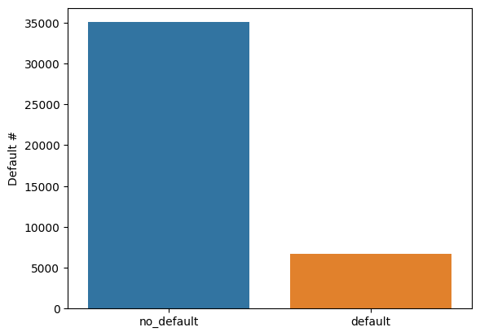
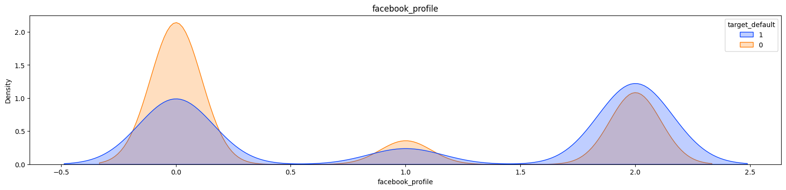
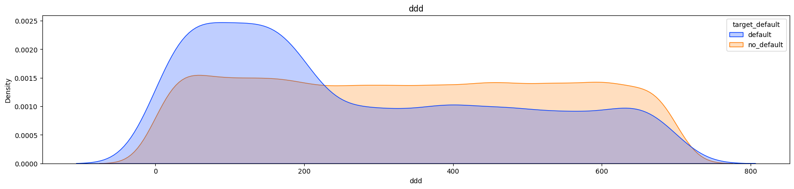
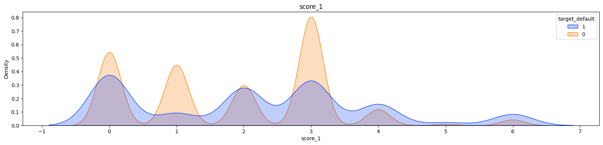
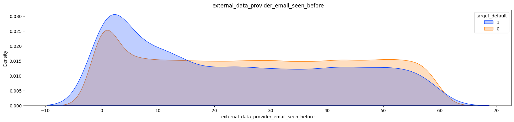
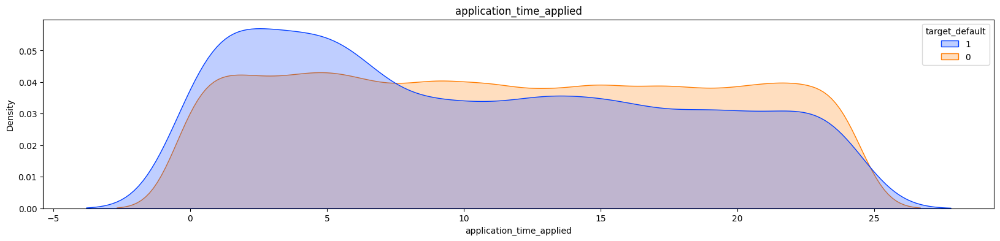

# Default Risk Analysis

[][mysite]

O notebook é melhor visualizado usando o Google Colab ([link][1]).

O Nubank, fintech brasileira, promoveu uma competição com o intuito de buscar por novos talentos. Um dos objetivos propostos na competição foi o de criar um modelo que conseguisse prever quais clientes não iriam honrar com suas dívidas, incorrendo no que é chamado de default. Para fazer a previsões, era usado um dataset com informações sobre o cliente. Um dos grandes problemas desse tipo de dataset é seu desbalanço de classe, temos uma quantidade enorme de clientes que pagam suas dívidas e uma quantidade mínima que não pagam, isso torna a previsão difícil. 

O que você vai ver neste notebook:
  1. Limpeza dos dados e produção de features novas.
  2. Uso de Pipeline para facilitar o uso dos dados em diversos modelos e minimizar as chances de data leak.
  3. Como lidar com um dataset desbalanceado.
  4. Escolha de métricas para dataset desbalanceados.
  5. Conversão de features para categóricas ordenadas e para One Hot Enconder (OHE).
  6. Redução de skewness das features usando log ou QuantileTransformer.
  7. Uso de gridsearch para buscar os melhores parâmetros dos modelos.
  8. Modelos usados: Decision Tree, Random Tree, Neural Network, Logistic Regression, Bagging, Random Patches, Adaboost e Voting Classifier. 
  9. Discussão dos resultados obtidos.

## Objetivo

Identificar o risco de default, risco de inadimplência do cliente, antes mesmos do cliente receber o cartão de crédito.

## Problemas do dataset

Este dataset possui as classes desbalanceadas por natureza, pois é esperado que o número de clientes que não cumprem com as suas obrigações com o banco sejam poucos. A imagem abaixo mostra o quanto o dataset é desbalanceado.



## Abordagem para criar novas features e procurar padrões 

As features desse dataset têm pouca ou nenhuma correlação com a chance de default do cliente. Então, temos que buscar por features novas. A ideia principal é tentar encontrar features com probabilidades assimétricas, como a feature `facebook_profile` na imagem abaixo. Note que clientes no grupo da classe 0, possuem uma chance maior de não incorrer em default, enquanto o grupo de clientes com a classe 2 tem uma chance maior de incorrer em default.



### Features encontradas com alguma assimetria

1. `facebook_profile`: Pessoas que não colocam o link do seu Facebook ao preencher a inscrição tem mais chances de ocorrem em default (é a classe 2.0).


1. `ddd`(feature extraída dos dados): Alguns valores de DDD são mais utilizados por clientes que ocorrem em default. 
  > Colocar informação sobre o DDD dentro de um modelo desses tem que ser feito com cuidado. As vezes o DDD pode indicar que temos uma região do país, como São Paulo, onde temos um número grande de pessoas utilizando o cartão do Nubank. Sendo assim, é esperado que nessa região também tenhamos um número maior de pessoas incorrendo em default.



2. `score_1`: Score de uma empresa externa, onde algumas das classes apresentam assimetrias.



3. `external_data_provider_email_seen_before`: Emails que foram utilizados poucas vezes em outros cadastros, tem mais chance de serem de clientes que vão incorrer em default. 
  > Obviamente, emails pouco usados podem ter sido criados somente com o inuito de criar uma conta no banco, pegar o dinheiro emprestado e nunca pagar.



1. `application_time_applied`(feature extraída dos dados): Pessoas que fazem o cadastro durante a madruga, tem mais chance de incorrerem em default.



> O resto das análises estão no notebook Google Colab ([link]([1])).

## Como usar:

1. Instalar o [Docker][docker] no computador local.
2. Crie uma imagem do docker usando o seguinte comando.
  >  O arquivo do docker incluído no repositório pressupõe que o computador tenha uma GPU.
  ```shell
  docker image build -t user_name:Image_name path_to_dockerfile
  ```
3. Inicie o container com o comando a seguir.
  ```shell
  docker run --gpus all -v $PWD:/project -w /project -p 8080:8080 -it --rm user_name:Image_name bash
  ```
4. Abra o Jupyter Notebook com o comando a seguir.
  ```shell
  jupyter notebook
  ```

[1]:https://colab.research.google.com/github/RGivisiez/credit-card-risk-analysis/blob/main/Default_risk_Nubank_dataset.ipynb
[docker]:https://docs.docker.com/install/
[mysite]: https://rgivisiez.github.io/
