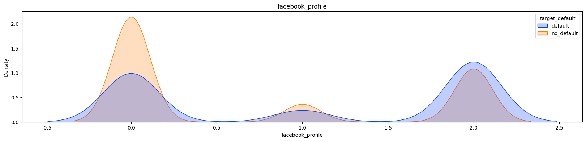
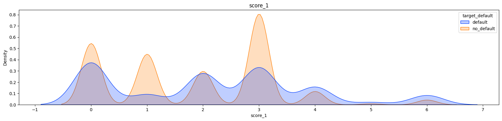
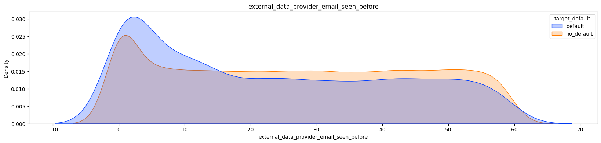
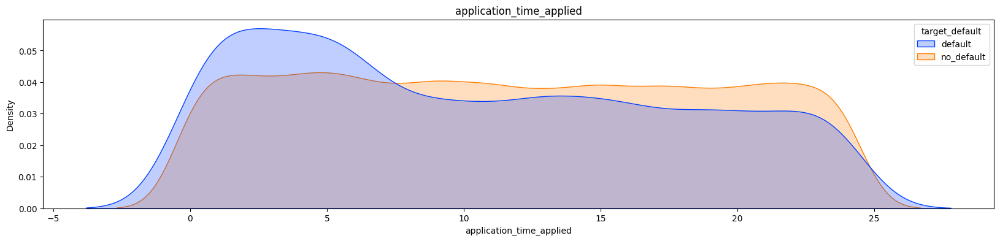

# Default Risk Analysis

O notebook é melhor visualizado usando o Google Colab ([link][1]).

O Nubank, fintech brasileira, promoveu uma competição com o intuito de buscar por novos talentos. Um dos objetivos propostos na competição foi o de criar um modelo que conseguisse prever quais clientes não iriam honrar com suas dívidas, incorrendo no que é chamado de default. Para fazer a previsões, era usado um dataset com informações sobre o cliente. Um dos grandes problemas desse tipo de dataset é seu desbalanço de classe, temos uma quantidade enorme de clientes que pagam suas dívidas e uma quantidade mínima que não pagam, isso torna a previsão difícil. 

O que você vai ver neste notebook:
  1. Limpeza dos dados e produção de features novas.
  2. Uso de Pipeline para facilitar o uso dos dados em diversos modelos e minimizar as chances de data leak.
  3. Como lidar com um dataset desbalanceado.
  4. Escolha de métricas para dataset desbalanceados.
  5. Conversão de features para categóricas ordenadas e para One Hot Enconder (OHE).
  6. Redução de skewness das features usando log ou QuantileTransformer.
  7. Uso de gridsearch para buscar os melhores parâmetros dos modelos.
  8. Modelos usados: Decision Tree, Random Tree, Neural Network, Logistic Regression, Bagging, Random Patches, Adaboost e Voting Classifier. 
  9. Discussão dos resultados obtidos.

-------

# Risco de Inadimplência

Este dataset foi parte de uma competição promovida pelo Nubank, uma Fintech brasileira, com o intuito de buscar por novos talentos. Um dos objetivos propostos pelo Nubank era o de identificar o risco de default, que é o risco de inadimplência do cliente, antes mesmos do cliente receber o cartão de crédito. Desta forma o Nubank consegue diminuir suas perdas com dívidas não pagas.

> O objetivo é usar as informações disponíveis no datatset para identificar os clientes que tem mais chances de incorrer em default.

# Comentários sobre o dataset e a abordagem

> **Variável alvo:** A variável `target_default` é o que vamos tentar prever.

Este dataset possui as classes desbalanceadas por natureza, pois é esperado que o número de clientes que não cumprem com as suas obrigações com o banco sejam poucos. Esse é um dos pontos que deixam as análises e previsão mais difíceis, não temos informação suficiente sobre os clientes que ocorrem em default. A imagem abaixo mostra o quanto o dataset é desbalanceado.

Existem algumas técnicas utilizadas para compensar esse desbalanço de classe, como o [Under Sample](https://imbalanced-learn.org/stable/under_sampling.html) ou [Over Sample](https://imbalanced-learn.org/stable/over_sampling.html). Porém, esses métodos podem distorcer muito os dados e fazer com que os algoritmos não tenham um bom desempenho em dados novos. O ideal é utilizar o dataset completo e lidar com o desbalanço de classe sem fazer nenhuma modificação no dataset. Neste notebook, nós vamos utilizar as duas formas, usaremos o dataset completo e o dataset após o Under Sample.

# Abordagem para criar novas features e procurar padrões

Como esse é um dataset difícil, com as features tendo pouca ou nenhuma correlação com a variável alvo `target_default`, temos que buscar por features novas. A ideia principal é tentar encontrar features com probabilidades assimétricas, como a feature `facebook_profile` na imagem abaixo. Note que clientes no grupo da classe 0, possuem uma chance maior de não incorrer em default, enquanto o grupo de clientes com a classe 2 tem uma chance maior de incorrer em default.

Como será visto, durante as avaliações dos modelos, principalmente o de Decision Tree, é bem claro que features com essas assimetrias são importantes e facilitam a identificação de clientes que ocorrem em default. Porém, não temos muitas dessas features disponíveis, temos que tratar alguns dados para encontrá-las. As que eu encontrei foram `facebook_profile`, `ddd`, `score_1`, `external_data_provider_email_seen_before` e `application_time_applied`.

1. `facebook_profile`: Pessoas que não colocam o link do seu Facebook ao preencher a inscrição tem mais chances de ocorrem em default (é a classe 2.0).

1. `ddd`(feature extraída dos dados): Alguns valores de DDD são mais utilizados por clientes que ocorrem em default. 
  > Colocar informação sobre o DDD dentro de um modelo desses tem que ser feito com cuidado. As vezes o DDD pode indicar que temos uma região do país, como São Paulo, onde temos um número grande de pessoas utilizando o cartão do Nubank. Sendo assim, é esperado que nessa região também tenhamos um número maior de pessoas incorrendo em default.

2. `score_1`: Score de uma empresa externa, onde algumas das classes apresentam assimetrias.

3. `external_data_provider_email_seen_before`: Emails que foram utilizados poucas vezes em outros cadastros, tem mais chance de serem de clientes que vão incorrer em default. 
  > Obviamente, emails pouco usados podem ter sido criados somente com o inuito de criar uma conta no banco, pegar o dinheiro emprestado e nunca pagar.

1. `application_time_applied`(feature extraída dos dados): Pessoas que fazem o cadastro durante a madruga, tem mais chance de incorrerem em default.

# Como devemos comprar os modelos e avaliar os resultados

Vamos utilizar a métrica PR-AUC ([site pessoal][PR]) para avaliar qual é o melhor modelo e a métrica de Recall([site pessoal][PR]) para maximizar a taxa de verdadeiros positivos, i.e., queremos identificar a maior quantidade de clientes que irão incorrer em default.

> De forma mais geral, utilizamos a curva PR para avaliar modelos treinados em datasets com desbalanço de classe, mas como estamos interessados em diminuir o número de falsos negativos e aumentar o número de verdadeiros positivos, podemos utilizar essa curva mesmo em dataset balanceados. Sendo assim, independente do dataset utilizado, o completo ou com o Under Sample, vamos usar as mesmas métricas.

> O resto das análises estão no notebook Google Colab ([link]([1])).

[1]:https://colab.research.google.com/github/RGivisiez/credit-card-risk-analysis/blob/main/Default_risk_Nubank_dataset.ipynb
[PR]:https://rgivisiez.github.io/post/ROC-PR/
